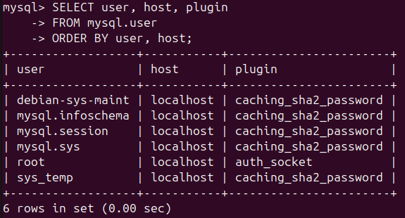
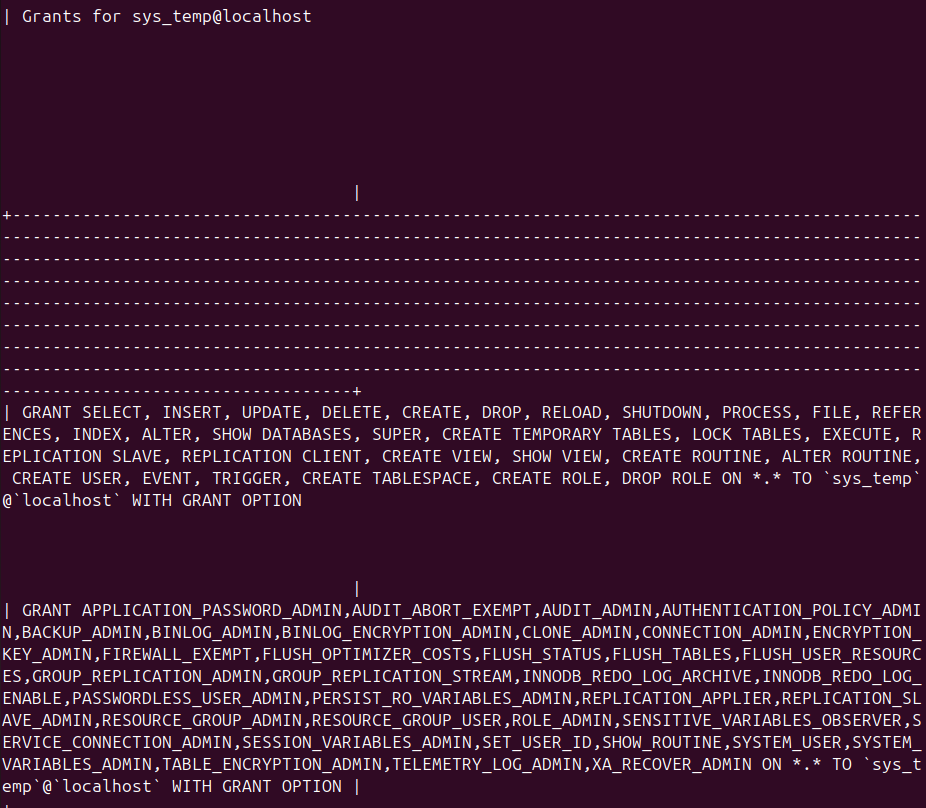
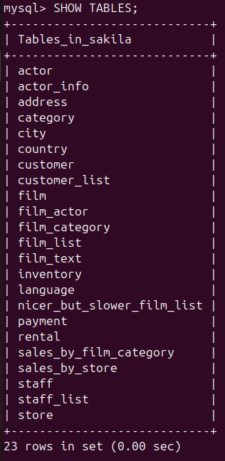
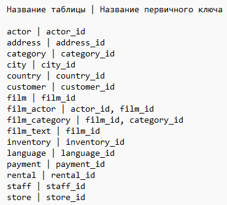

# Домашнее задание к занятию "Работа с данными (DDL/DML)" - Nikiforov Viktor

### Задание 1

## Список пользователей

## Список прав пользователя

## Таблицы БД

## Запросы

	1) Создание пользователя
	CREATE USER 'sys_temp'@'localhost' IDENTIFIED BY 'TestPass123';

	2) Список пользователей
	SELECT user, host, plugin
	FROM mysql.user
	ORDER BY user, host;

	3) Выдать все права
	GRANT ALL PRIVILEGES ON *.* TO 'sys_temp'@'localhost' WITH GRANT OPTION;
	FLUSH PRIVILEGES;

	4) Показать права пользователя
	SHOW GRANTS FOR 'sys_temp'@'localhost';

	5) Список таблиц Sakila
	USE sakila;
	SHOW TABLES;

---

### Задание 2

## Список полей и их первичных ключей

---
