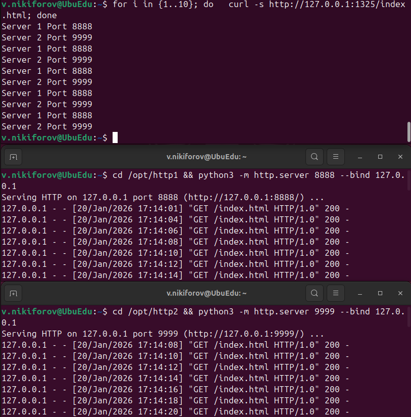
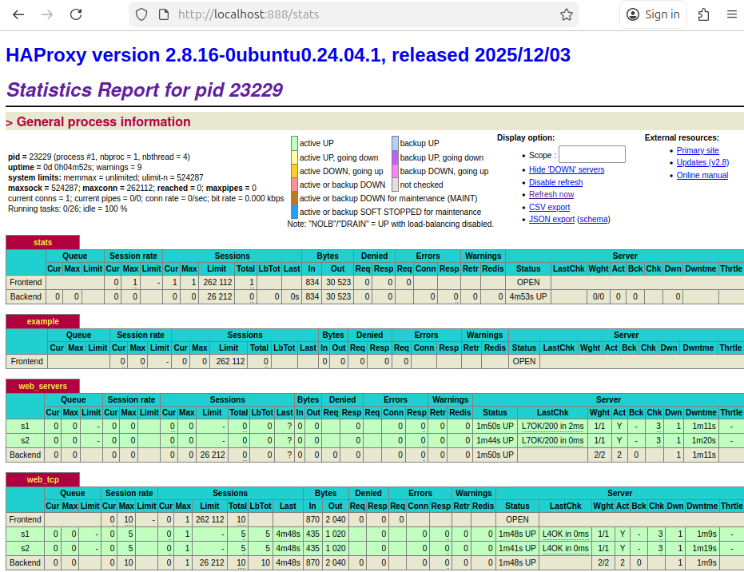
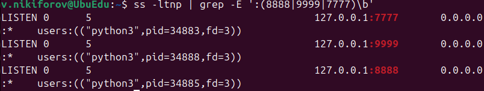
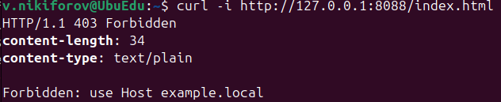
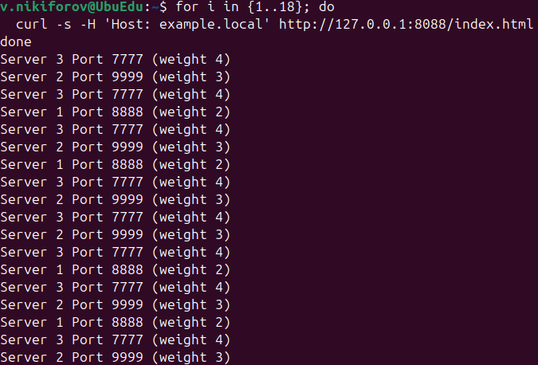
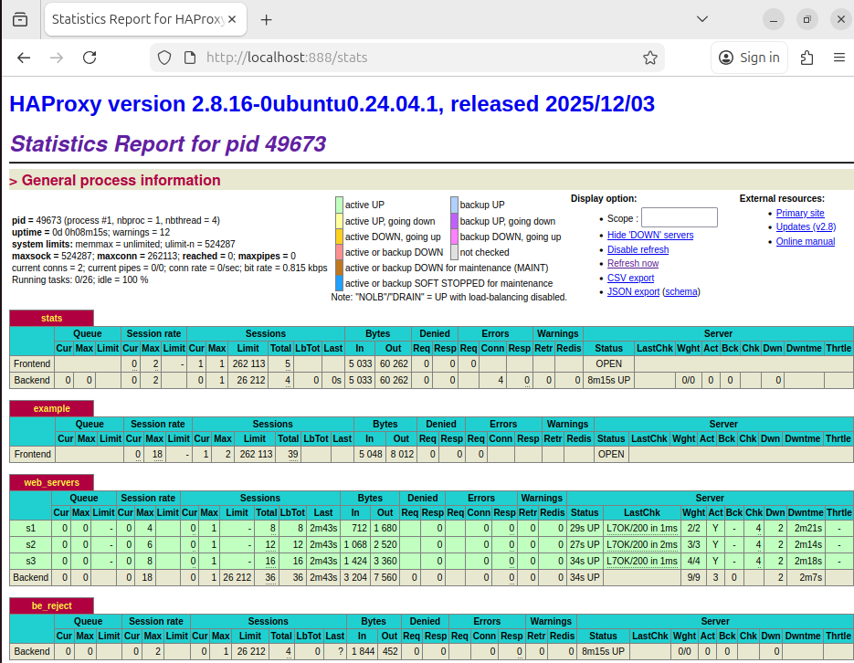

# Домашнее задание к занятию "Кластеризация и балансировка нагрузки" - Nikiforov Viktor

### Задание 1

## HAProxy Load Balance L4

### L4 Balance

### HAProxy Interface

### HAProxy Config File
[haproxy1.cfg](haproxy1.cfg)

---

### Задание 2

## HAProxy Load Balance L7

### Python Servers Status

### Check Without Domain

### Check With Domain

### HAProxy Interface

### HAProxy Config File  
[haproxy2.cfg](haproxy2.cfg)

---
