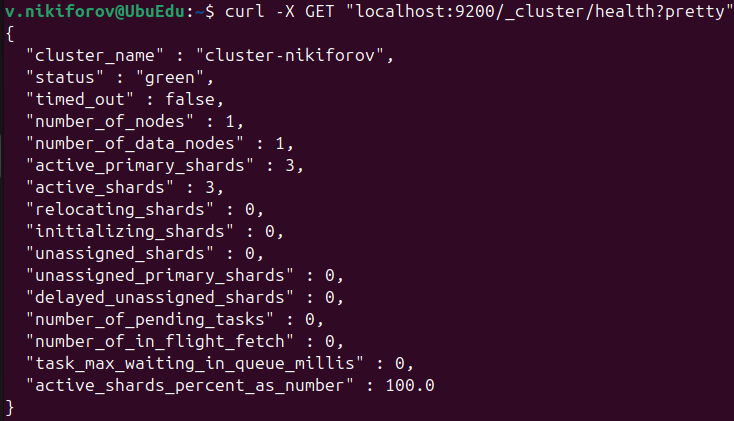
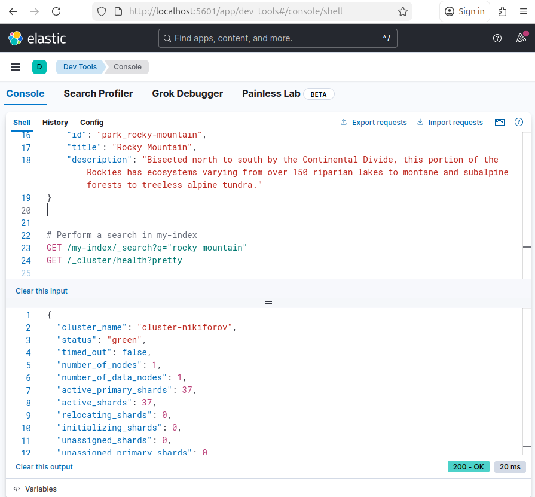
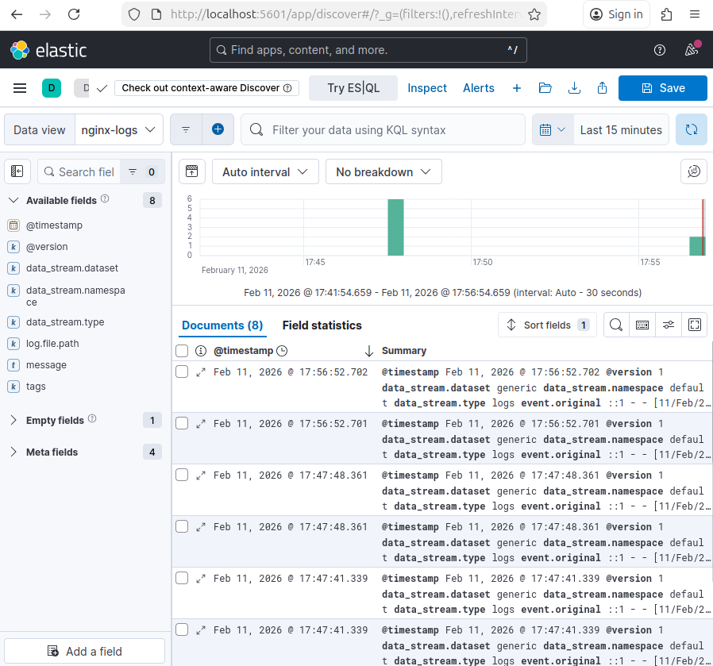
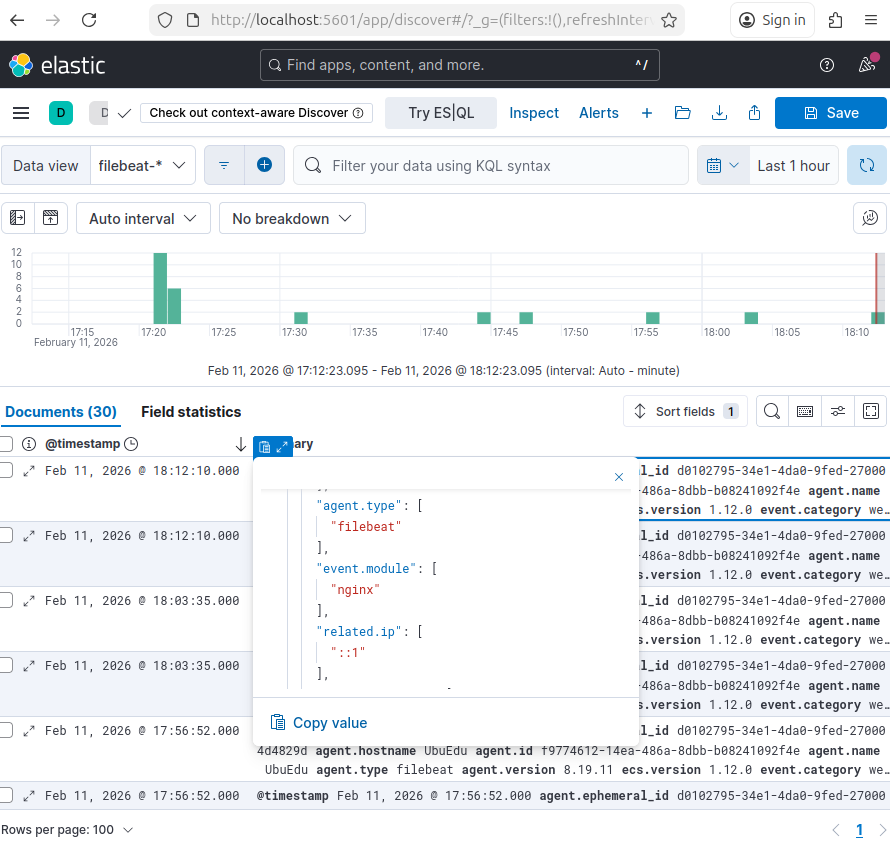

# Домашнее задание к занятию "ELK" - Nikiforov Viktor

### Задание 1

## Elasticsearch

### Установите и запустите Elasticsearch, после чего поменяйте параметр cluster_name на случайный.

---

### Задание 2

## Kibana

### Установите и запустите Kibana.

---

### Задание 3

## Logstash

### Установите и запустите Logstash и Nginx. С помощью Logstash отправьте access-лог Nginx в Elasticsearch.

---

### Задание 4

## Filebeat

### Установите и запустите Filebeat. Переключите поставку логов Nginx с Logstash на Filebeat.

---
