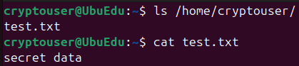
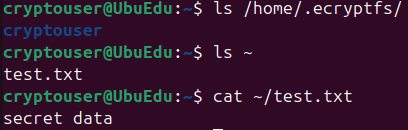
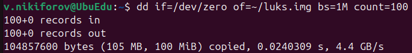
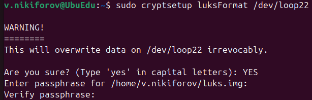
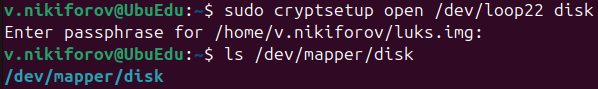
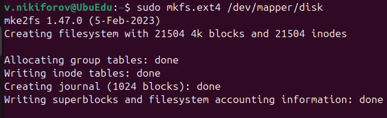
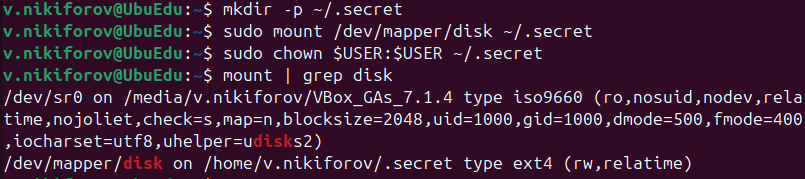
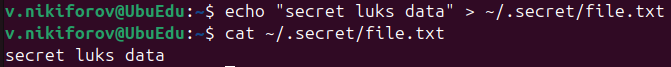

# Домашнее задание к занятию "Защита хоста" - Nikiforov Viktor

## Задание 1

### Установка

Установлен пакет ecryptfs-utils:

    sudo apt update
    sudo apt install ecryptfs-utils

### Создание пользователя

Создан пользователь cryptouser:

    sudo adduser cryptouser

### Подготовка данных

Создан тестовый файл:

    echo "secret data" > ~/test.txt

### Шифрование

Выполнено шифрование:

    sudo ecryptfs-migrate-home -u cryptouser

### Проверка

После входа данные доступны:

    ls ~
    cat ~/test.txt

### Зашифрованные данные

### Вывод

Домашний каталог пользователя был успешно зашифрован с использованием eCryptfs.
Данные автоматически расшифровываются при входе пользователя в систему и хранятся в зашифрованном виде.

---

## Задание 2

### Установка

Установлен пакет cryptsetup:

    sudo apt update
    sudo apt install cryptsetup

### Создание раздела (100 МБ)

Создан файл:

    dd if=/dev/zero of=~/luks.img bs=1M count=100

### Подключение loop-устройства

    sudo losetup -fP ~/luks.img
    losetup -a

### Шифрование

    sudo cryptsetup luksFormat /dev/loop22

### Открытие раздела

    sudo cryptsetup open /dev/loop22 disk
    ls /dev/mapper/disk

### Создание файловой системы

    sudo mkfs.ext4 /dev/mapper/disk

### Монтирование

    mkdir ~/.secret
    sudo mount /dev/mapper/disk ~/.secret
    sudo chown $USER:$USER ~/.secret
    mount | grep disk

### Работа с данными

    echo "secret luks data" > ~/.secret/file.txt
    cat ~/.secret/file.txt

### Завершение

    sudo umount ~/.secret
    sudo cryptsetup luksClose disk

### Вывод

Был создан виртуальный раздел размером 100 МБ, зашифрованный с использованием LUKS.
После открытия раздела данные доступны, а после закрытия - недоступны без ввода пароля.
Это обеспечивает защиту данных на уровне блочного устройства.

---
