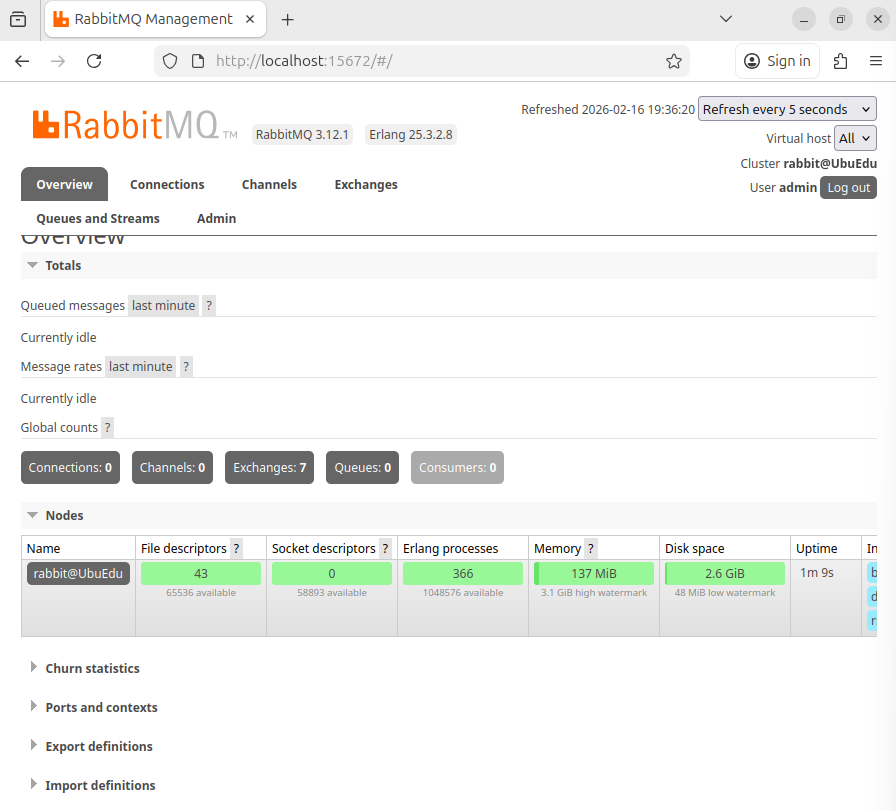
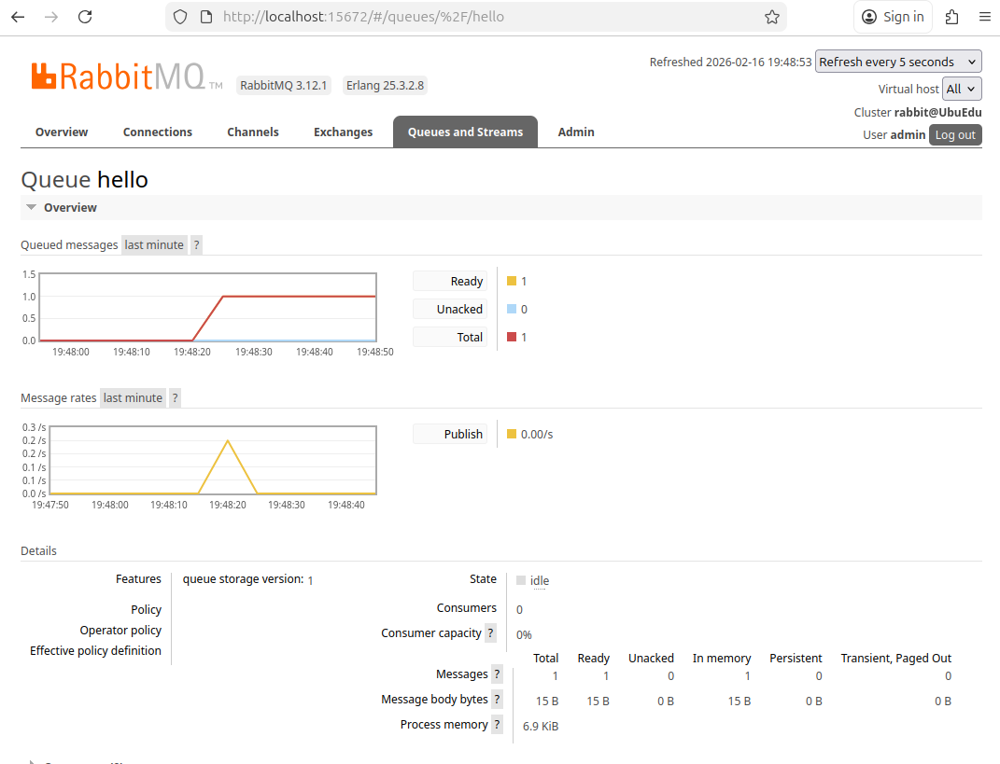
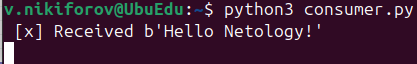
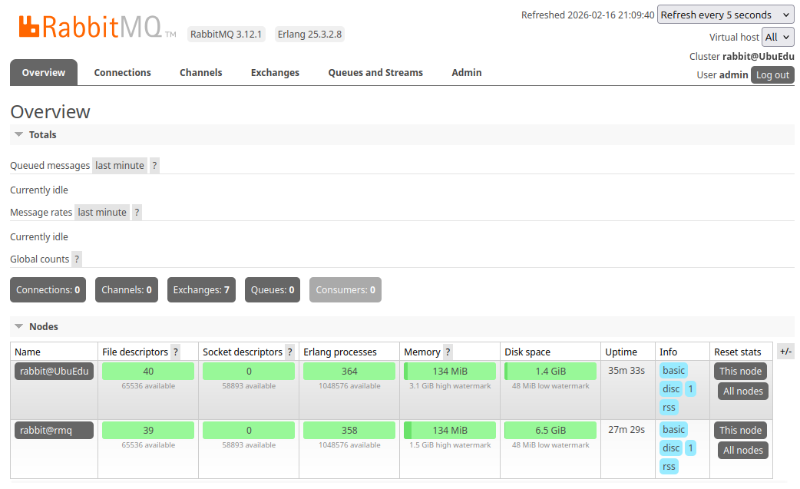
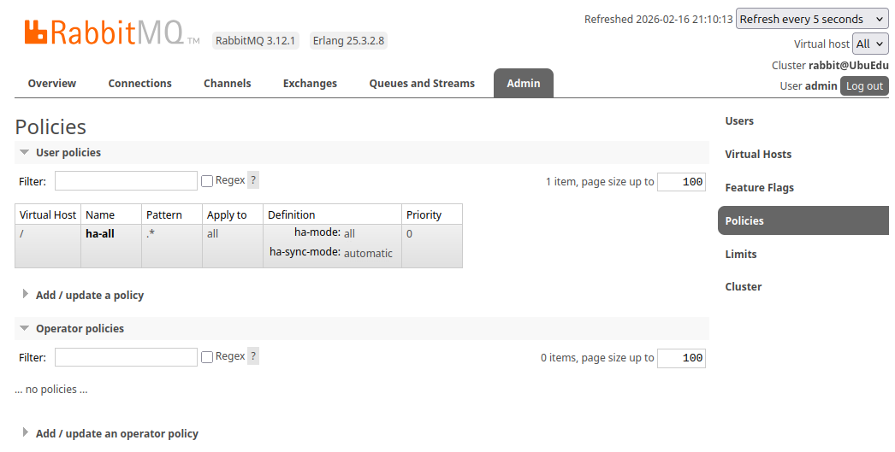
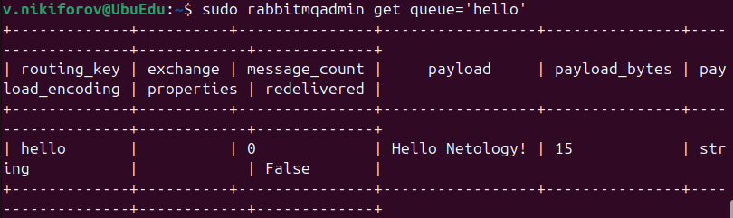
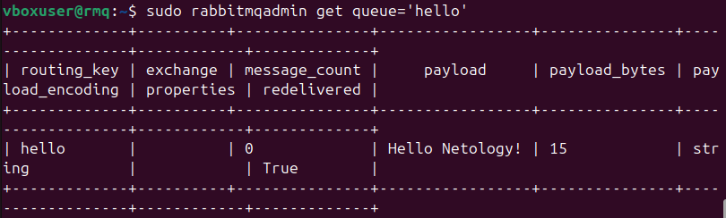
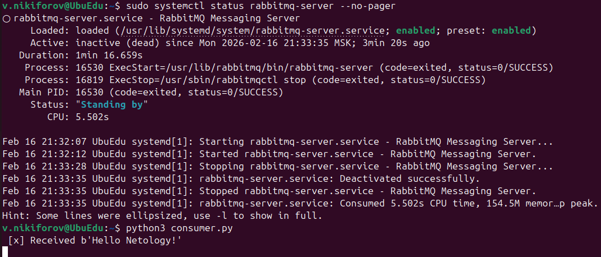

# Домашнее задание к занятию "Очереди RabbitMQ" - Nikiforov Viktor

### Задание 1

## Установка RabbitMQ

---

### Задание 2

## Отправка и получение сообщений

---

### Задание 3

## Подготовка HA кластера

[Cluster Status 1](cluster_status_ubuedu.txt)

[Cluster status 2](cluster_status_rmq.txt)

---
