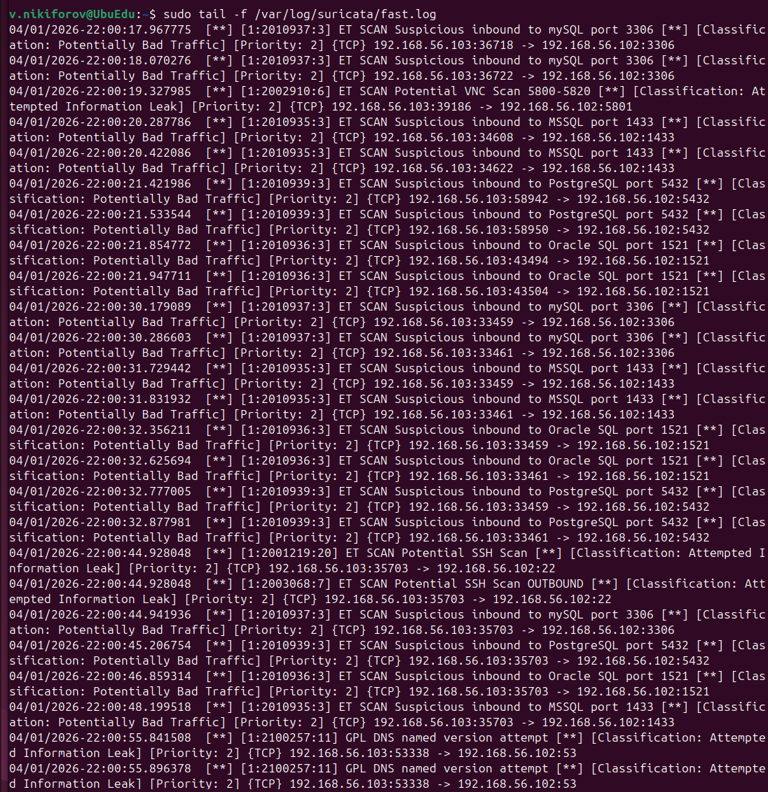
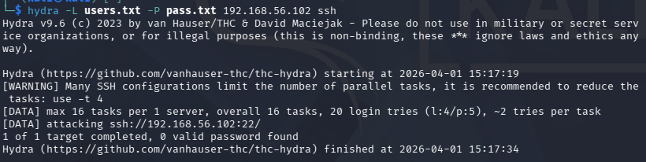
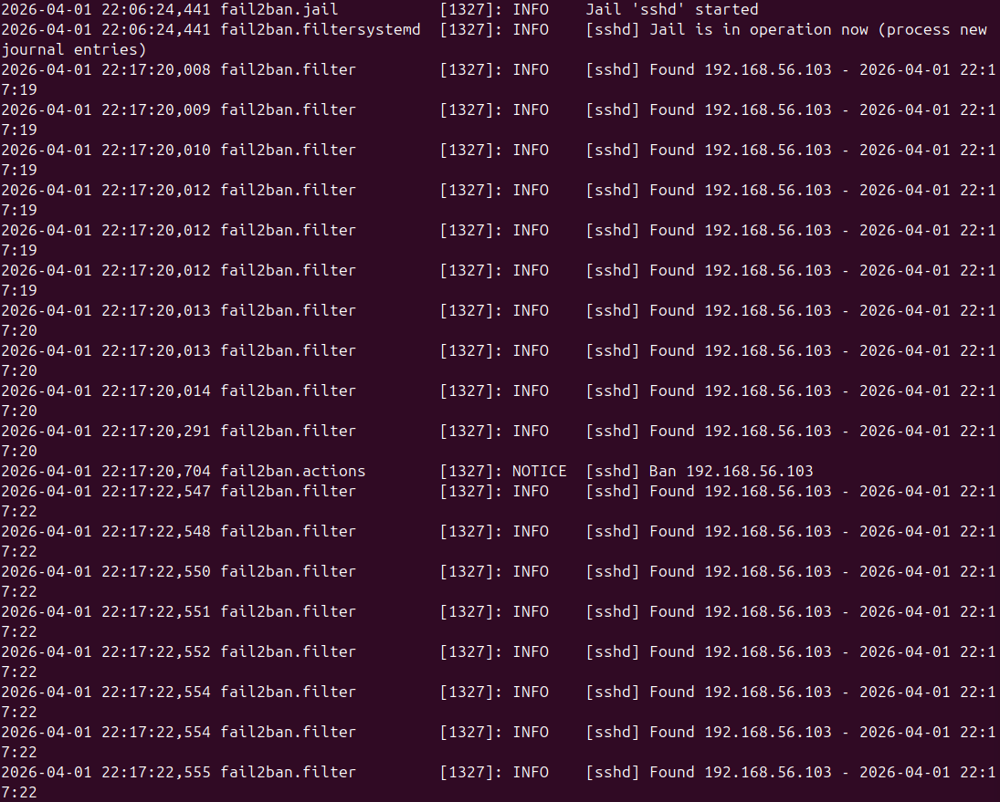

# Домашнее задание к занятию "Защита сети" - Nikiforov Viktor

# Анализ защиты сети (Suricata и Fail2Ban)

## Среда выполнения

Защищаемая система: Ubuntu
IP-адрес: 192.168.56.102

Система злоумышленника: Kali Linux
IP-адрес: 192.168.56.103

Обе системы находятся в одной подсети: 192.168.56.0/24

---

## Задание 1

### Выполнение сканирования

С Kali Linux выполнены команды:

- sudo nmap -sA 192.168.56.102
- sudo nmap -sT 192.168.56.102
- sudo nmap -sS 192.168.56.102
- sudo nmap -sV 192.168.56.102

---

### Логи Suricata

Пример зафиксированных событий:

- ET SCAN Suspicious inbound to mySQL port 3306
- ET SCAN Suspicious inbound to MSSQL port 1433
- ET SCAN Suspicious inbound to PostgreSQL port 5432
- ET SCAN Suspicious inbound to Oracle SQL port 1521
- ET SCAN Potential SSH Scan
- ET SCAN Nmap Scripting Engine User-Agent Detected
- GPL DNS named version attempt

---

### Анализ результатов

В ходе сканирования были обнаружены:

- попытки сканирования портов баз данных (MySQL, MSSQL, PostgreSQL, Oracle)
- сканирование SSH и VNC
- попытки определения версий сервисов
- попытки получения информации о DNS

Suricata классифицировала трафик как:

- Potentially Bad Traffic
- Attempted Information Leak
- Web Application Attack

Fail2Ban не зафиксировал событий, так как не было попыток аутентификации.

---

## Задание 2

### Подготовка словарей

- nano users.txt
- nano pass.txt

Пример содержимого:

users.txt

- root
- user
- test
- ubuntu

pass.txt

- 123456
- password
- qwerty
- admin

---

### Проведение атаки

hydra -L users.txt -P pass.txt 192.168.56.102 ssh

---

### Логи Fail2Ban

Пример записей:

- [sshd] Found 192.168.56.103
- [sshd] Ban 192.168.56.103

---

### Анализ результатов

В ходе атаки были зафиксированы:

- множественные неудачные попытки входа по SSH
- обнаружение атакующего IP-адреса
- автоматическая блокировка IP

Fail2Ban успешно предотвратил атаку методом блокировки источника.

---
