# Домашнее задание к занятию «Оркестрация группой Docker контейнеров на примере Docker Compose»

---

# Задача 1

## Создание собственного образа nginx

Создан Dockerfile:

```dockerfile
FROM nginx:1.29.0

COPY index.html /usr/share/nginx/html/index.html
```

Создан файл `index.html`:

```html
<html>
<head>
Hey, Netology
</head>
<body>
<h1>I will be DevOps Engineer!</h1>
</body>
</html>
```

### Ответ

Ссылка на репозиторий Docker Hub:

```text
https://hub.docker.com/repository/docker/kefffirchik/custom-nginx/general
```

---

# Задача 2

## Запуск контейнера из собственного образа

Контейнер был запущен и переименован. Выполнена проверка публикации порта, логов контейнера и доступности страницы.

### Скриншот

```md
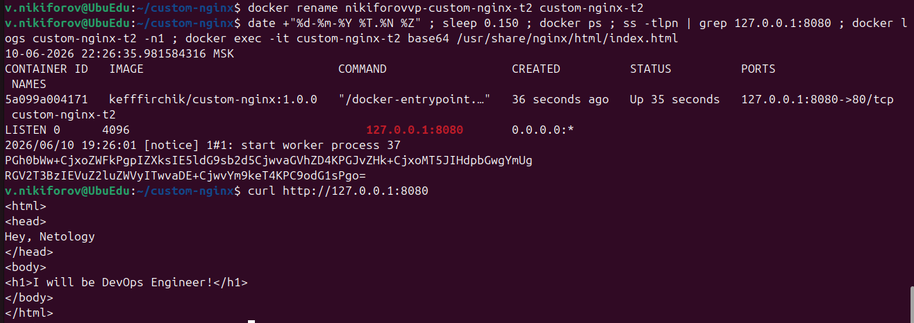
```

---

# Задача 3

## Работа со стандартными потоками контейнера

### Ответ

Контейнер остановился после нажатия `Ctrl+C`, потому что команда `docker attach` подключает терминал к основному процессу контейнера. После получения сигнала SIGINT основной процесс nginx завершился. Поскольку этот процесс является PID 1 внутри контейнера, Docker остановил контейнер.

### Скриншот 1

```md
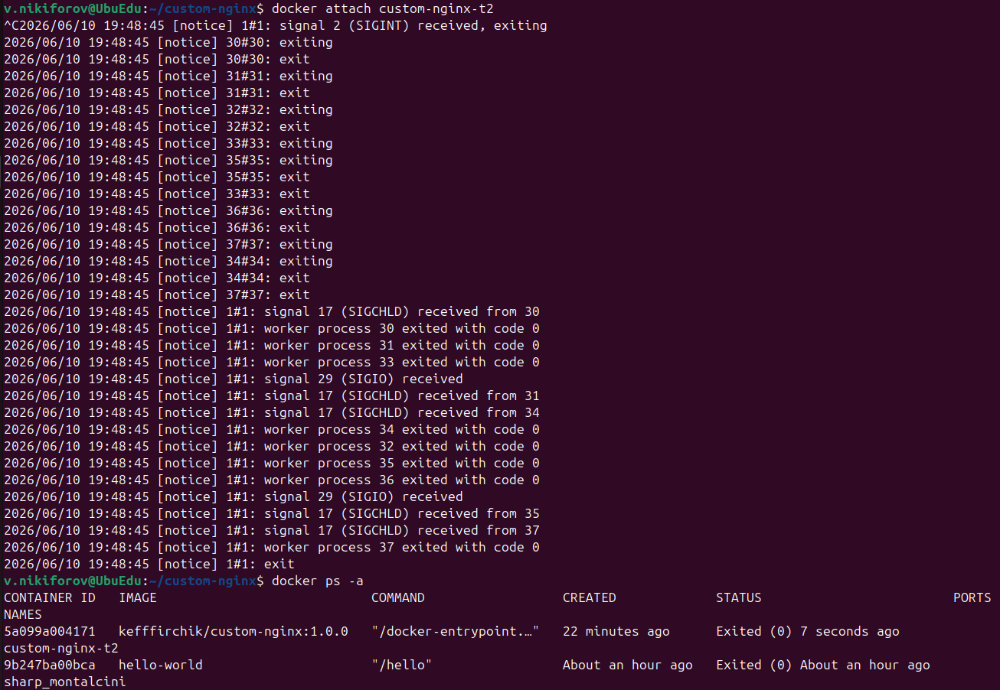
```

### Скриншот 2

```md
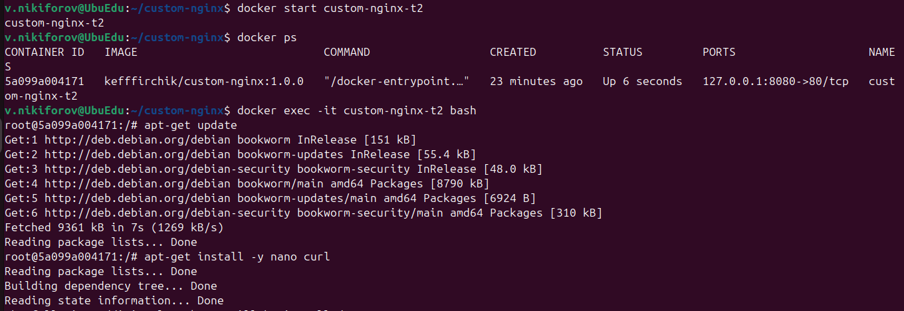
```

### Скриншот 3

```md
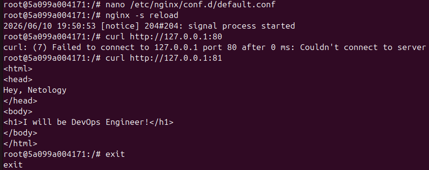
```

### Ответ

После изменения конфигурации nginx начал прослушивать порт 81 внутри контейнера, однако Docker продолжал перенаправлять трафик с порта 8080 хостовой машины на порт 80 контейнера.

В результате запросы на `http://127.0.0.1:8080` перестали корректно обрабатываться, так как внутри контейнера больше не было процесса, прослушивающего порт 80.

### Скриншот 4

```md
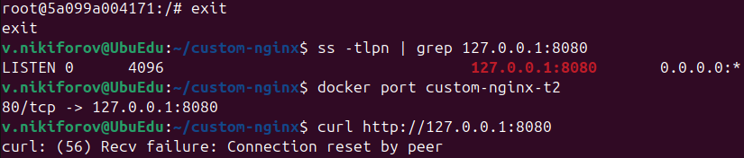
```

### Скриншот 5

```md
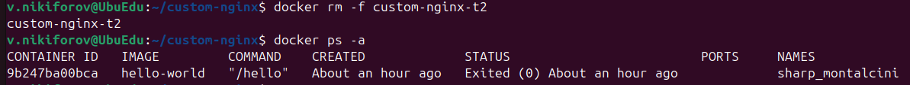
```

---

# Задача 4

## Использование bind mount

### Ответ

Оба контейнера получили доступ к одной и той же директории хостовой системы через bind mount. Файлы, созданные внутри контейнера и на хостовой машине, стали доступны одновременно из обоих контейнеров.

### Скриншот

```md
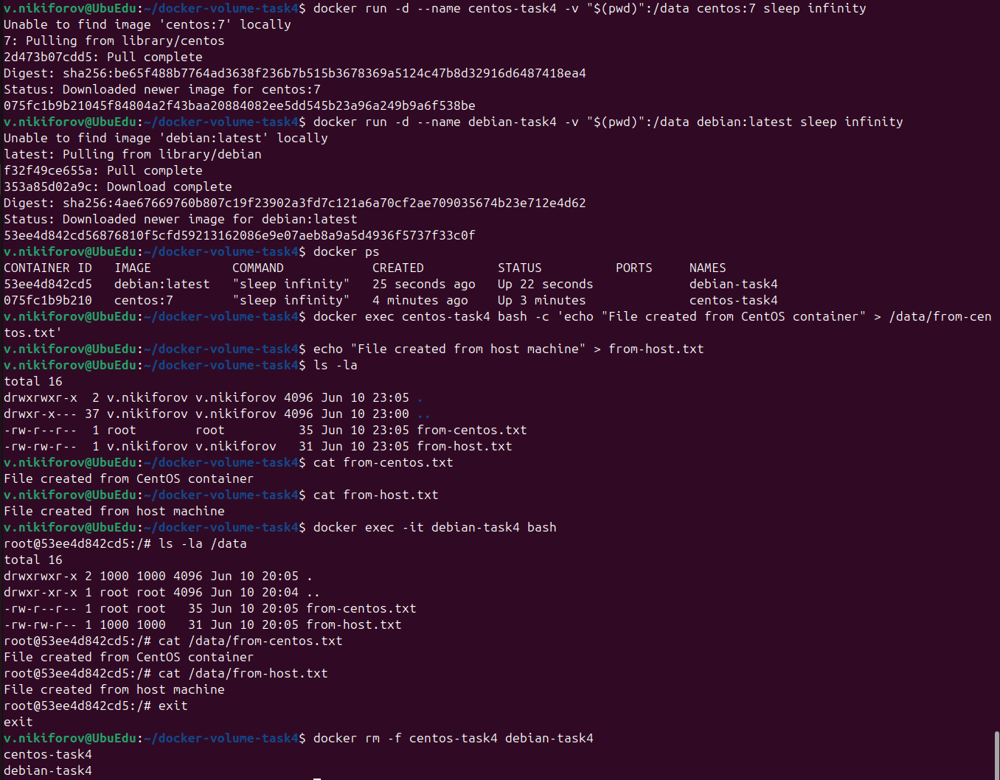
```

---

# Задача 5

## Работа с Docker Compose

### Ответ

При наличии одновременно файлов compose.yaml и docker-compose.yaml Docker Compose использовал файл compose.yaml, поскольку согласно современному стандарту Compose этот файл имеет более высокий приоритет и считается основным конфигурационным файлом проекта. Это подтверждается сообщением:

```text
Using /tmp/netology/docker/task5/compose.yaml
```

Поэтому был запущен только сервис portainer, описанный в файле compose.yaml.

### Скриншот 1

```md
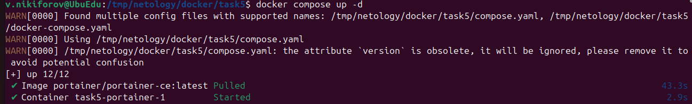
```

## Использование include

После изменения `compose.yaml` были подняты сервисы:

- Portainer
- Registry

### Скриншот 2

```md
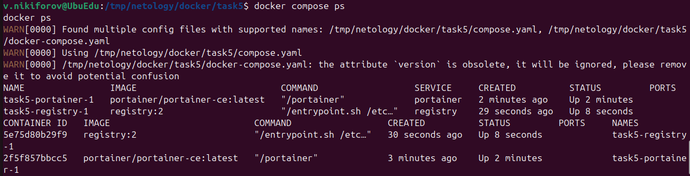
```

## Загрузка образа в локальный Registry

### Скриншот 3

```md
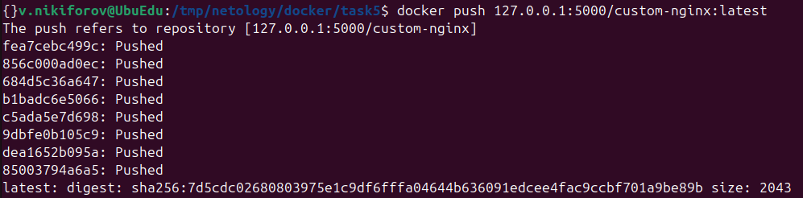
```

## Inspect контейнера в Portainer

### Скриншот 4

```md
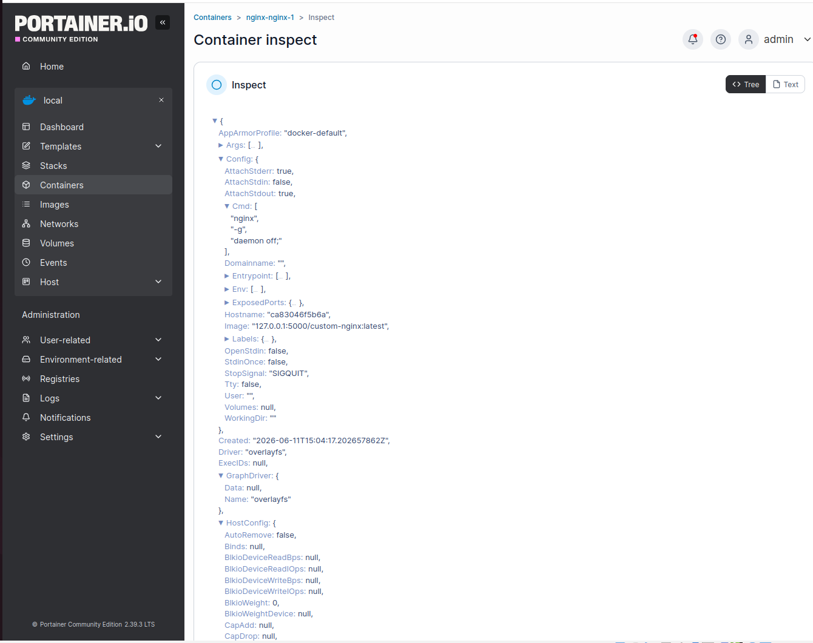
```

## Orphan Containers

### Ответ

Контейнер `task5-portainer-1` был создан предыдущей версией compose-проекта и больше не описывался текущей конфигурацией. Docker Compose определил его как orphan container и предложил удалить.

Для удаления orphan-контейнеров была выполнена команда:

```bash
docker compose up -d --remove-orphans
```

Остановка проекта выполнена одной командой:

```bash
docker compose down --remove-orphans
```

### Скриншот 5

```md
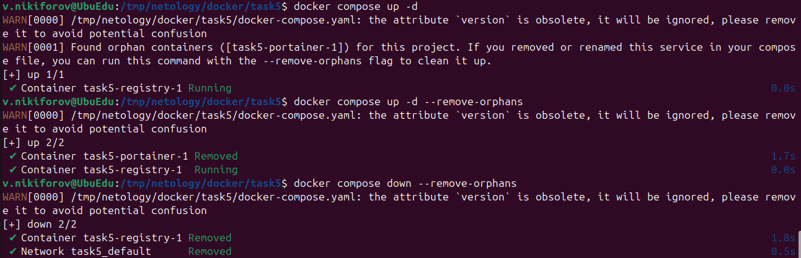
```

---

# Итог

В ходе выполнения работы были изучены:

- создание собственных Docker-образов;
- публикация образов в Docker Hub;
- работа со стандартными потоками контейнеров;
- изменение конфигурации nginx внутри контейнера;
- bind mount;
- Docker Compose;
- локальный Docker Registry;
- Portainer;
- управление Compose-проектами и orphan containers.
