# Домашнее задание к занятию «Практическое применение Docker»

## Цель работы

В ходе выполнения домашнего задания были выполнены следующие задачи:

- сборка Docker-образа Python-приложения с использованием Multi-stage Build;
- публикация образа в Yandex Container Registry;
- сканирование образа на наличие уязвимостей;
- запуск приложения с помощью Docker Compose;
- деплой приложения на виртуальную машину в Yandex Cloud;
- автоматическое резервное копирование базы данных MySQL;
- извлечение бинарного файла Terraform из Docker-образа.

---

# Задача 1

## Создание Dockerfile

Создан `Dockerfile.python` с использованием **Multi-stage Build**.

Образ успешно собран.

### Сборка образа

```bash
docker build -f Dockerfile.python -t shvirtd-python:task1 .
```

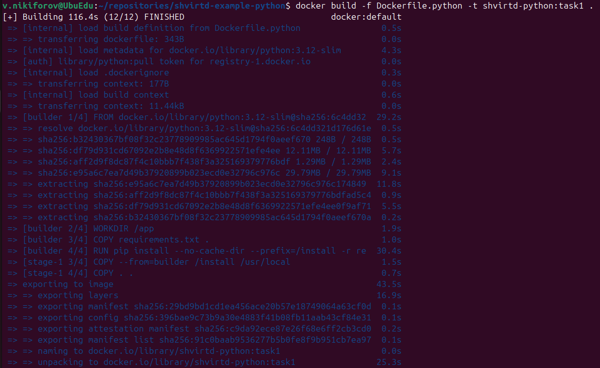

---

### Проверка наличия образа

```bash
docker images | grep shvirtd-python
```

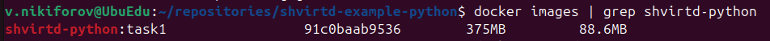

---

### Запуск контейнера

```bash
docker run --rm -p 5000:5000 shvirtd-python:task1
```

Приложение успешно запускается.

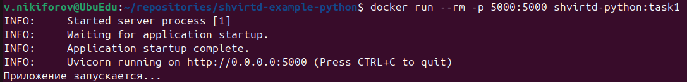

---

# Задача 2

## Работа с Yandex Container Registry

Создан Container Registry с именем **test**.

```bash
yc container registry create --name test
```

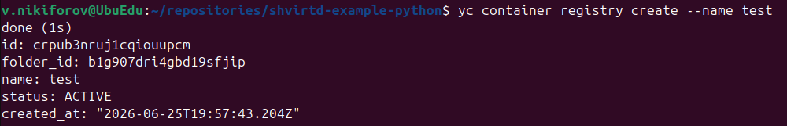

---

### Публикация образа

```bash
docker push cr.yandex/$REGISTRY_ID/shvirtd-python:task1
```

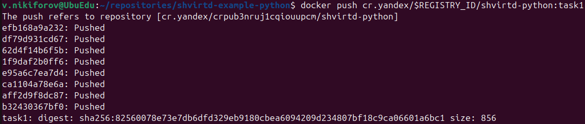

---

### Сканирование образа

```bash
yc container image scan $IMAGE_ID
```

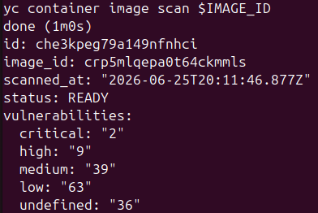

---

### Отчет по уязвимостям

```bash
yc container image list-vulnerabilities --scan-result-id che3kpeg79a149nfnhci
```

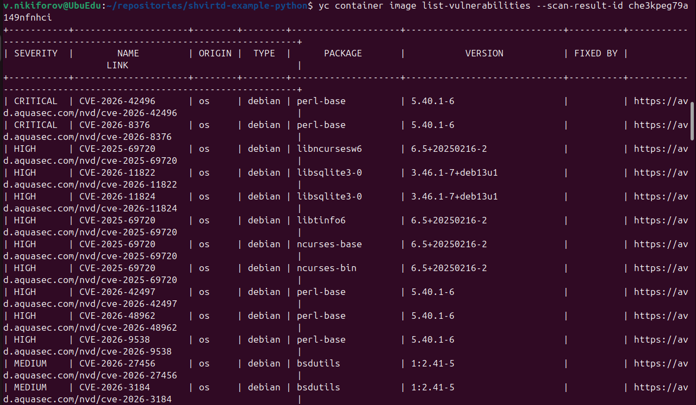

---

# Задача 3

## Docker Compose

Создан файл `compose.yaml`, включающий:

- web;
- db;
- ingress-proxy;
- reverse-proxy.

После запуска проекта приложение доступно на порту **8090**.

Проверка:

```bash
curl -L http://127.0.0.1:8090
```

Ответ приложения:

```
TIME: 2026-06-26 15:00:05
IP: 127.0.0.1
```

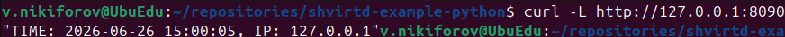

---

После первого обращения была создана таблица `requests`.

Проверка БД:

```sql
SELECT * FROM requests LIMIT 10;
```

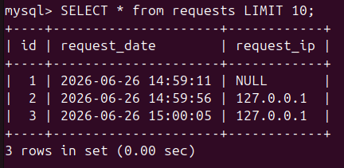

---

# Задача 4

## Развертывание проекта в Yandex Cloud

Проект успешно развернут на виртуальной машине.

Проверка доступности выполнялась через сервис:

https://check-host.net

Все HTTP-запросы успешно проходят через цепочку:

```
Internet
    ↓
Nginx
    ↓
HAProxy
    ↓
FastAPI
    ↓
MySQL
```

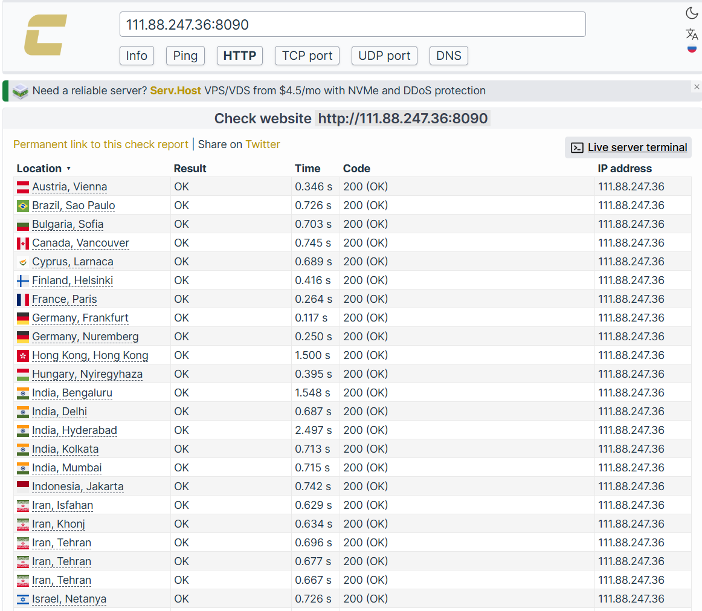

---

После внешнего обращения в базе данных появилась новая запись.

```sql
SELECT * FROM requests LIMIT 10;
```

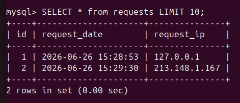

---

Ссылка на fork-репозиторий:

```
https://github.com/kefffirchik/shvirtd-example-python
```

---

# Задача 5

## Резервное копирование MySQL

Создан bash-скрипт:

```
backup-mysql.sh
```

Скрипт использует контейнер:

```
schnitzler/mysqldump
```

Исходный код bash-скрипта доступен по ссылке:

[backup-mysql.sh](https://github.com/kefffirchik/shvirtd-example-python/blob/main/backup-mysql.sh)

Параметры подключения к БД загружаются из существующего файла `.env`.

---

### Настройка cron

Резервное копирование выполняется каждую минуту.

```cron
* * * * * /opt/shvirtd-example-python/backup-mysql.sh >> /var/log/mysql-backup.log 2>&1
```

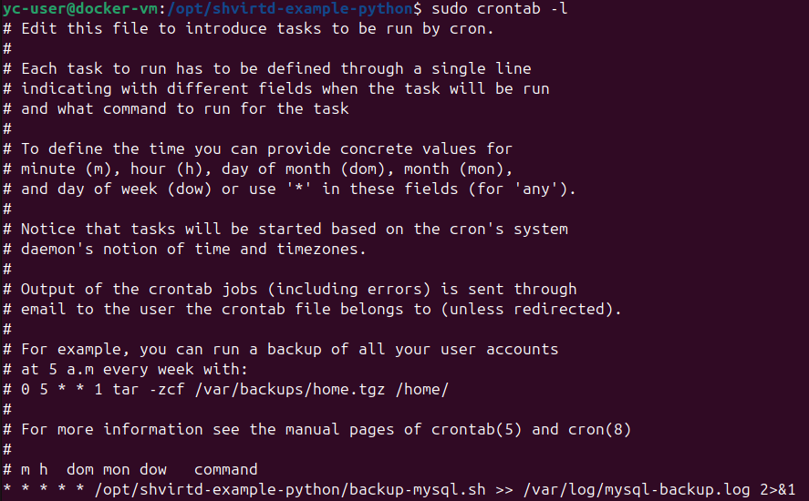

---

### Проверка резервных копий

Файлы резервных копий успешно создаются в каталоге:

```
/opt/backup
```

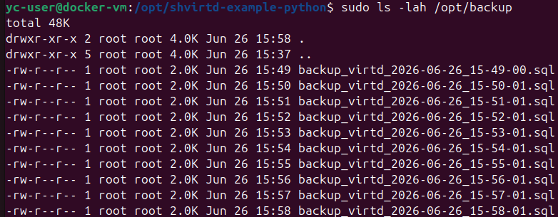

---

# Задача 6

## Извлечение Terraform из Docker-образа

Образ успешно загружен.

```bash
docker pull hashicorp/terraform:latest
```

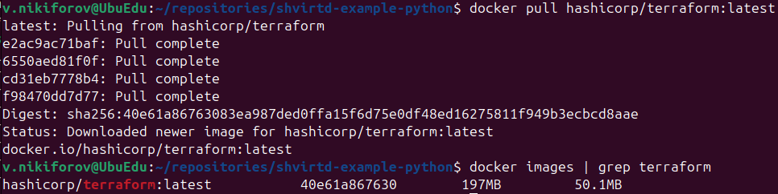

---

### Использование dive

При помощи `dive` найден бинарный файл:

```
/bin/terraform
```

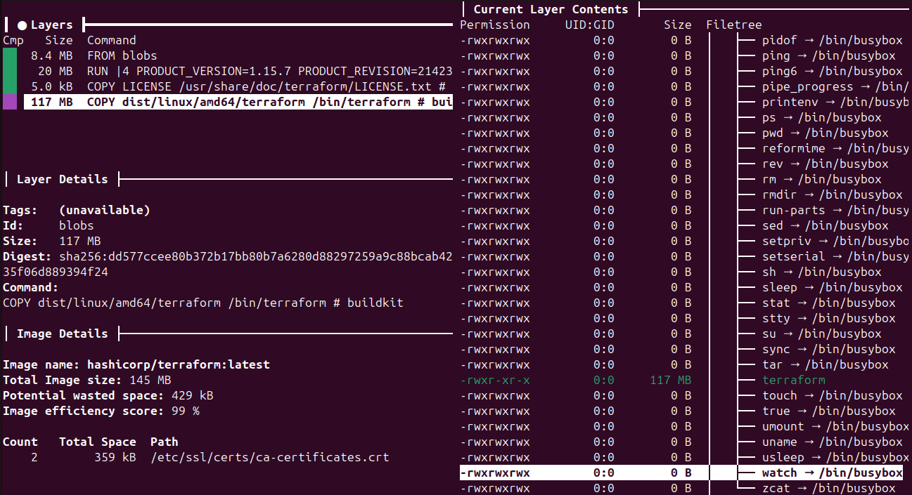

---

### Использование docker save

Образ сохранен:

```bash
docker save hashicorp/terraform:latest -o terraform.tar
```

После распаковки бинарный файл успешно извлечен.

Проверка:

```bash
./rootfs/bin/terraform version
```

Результат:

```
Terraform v1.15.7
```

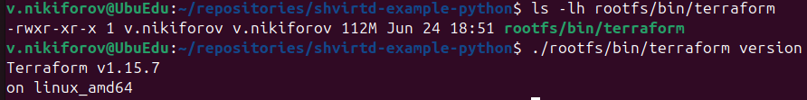

---

# Итог

В ходе выполнения домашнего задания были успешно выполнены следующие задачи:

- создан Dockerfile с использованием Multi-stage Build;
- собран Docker-образ приложения;
- опубликован образ в Yandex Container Registry;
- выполнено сканирование образа на уязвимости;
- настроен Docker Compose;
- выполнен деплой приложения в Yandex Cloud;
- реализовано автоматическое резервное копирование базы данных MySQL;
- выполнено извлечение бинарного файла Terraform из Docker-образа двумя способами (`dive` и `docker save`).
