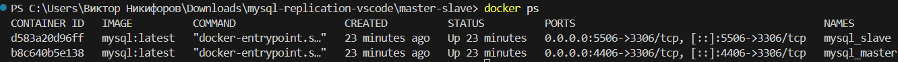
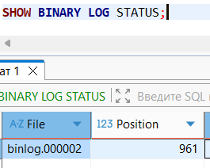
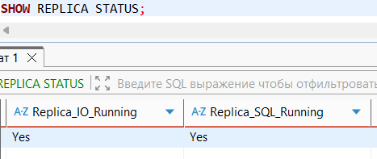
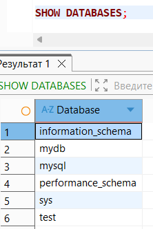
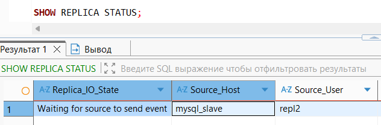
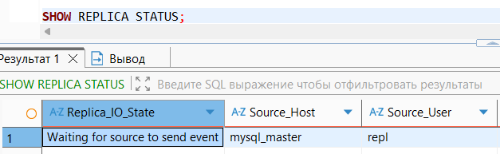
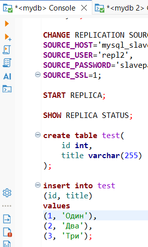
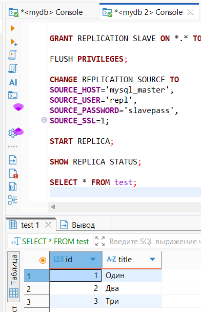
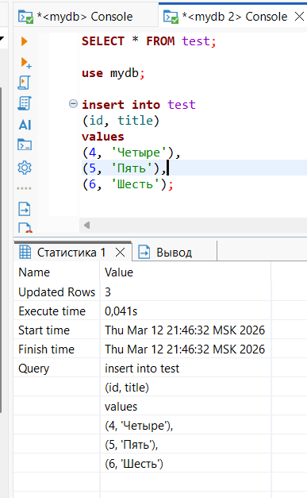
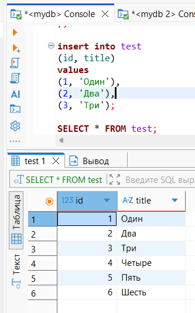

# Домашнее задание к занятию "Репликация и масштабирование. Часть 1" Nikiforov Viktor

### Задание 1

## На лекции рассматривались режимы репликации master-slave, master-master, опишите их различия.

	Основное различие между этими режимами заключается в том, что в master-slave запись производится только на одном сервере, а в master-master запись возможна на обоих серверах, при этом данные синхронизируются между ними.

---

### Задание 2

## Выполните конфигурацию master-slave репликации, примером можно пользоваться из лекции.

## Docker Containers

## Master Status

## Replica Status

## Replica Check

---

### Задание 3

## Выполните конфигурацию master-master репликации. Произведите проверку.

## Replica Status 1

## Replica Status 2

## Data Create 1

## Data Check 1

## Data Create 2

## Data Check 2

---
