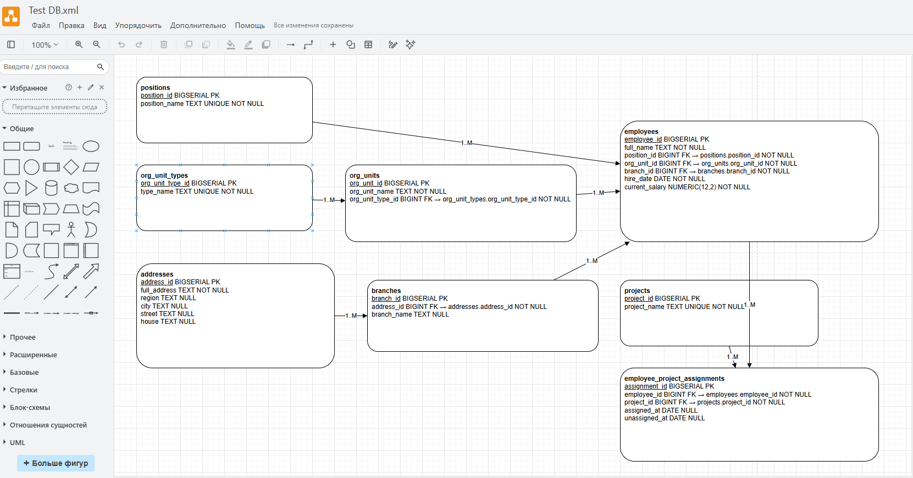

# Домашнее задание к занятию "Базы данных" - Nikiforov Viktor

### Задание 1

## Описание БД

Нормализованная модель данных. Этого достаточно, чтобы убрать дубли и корректно хранить связи.

1. employees — сотрудники
Хранит персональную карточку сотрудника из отчёта.
	employee_id BIGSERIAL PRIMARY KEY
	full_name TEXT - ФИО сотрудника
	position_id BIGINT NOT NULL - FK -> positions.position_id
	org_unit_id BIGINT NOT NULL - FK -> org_units.org_unit_id
	branch_id BIGINT NOT NULL - FK -> branches.branch_id
	hire_date DATE NOT NULL - дата найма
	current_salary NUMERIC(12,2) NOT NULL - оклад

2. positions - должности
Справочник должностей.
	position_id BIGSERIAL PRIMARY KEY
	position_name TEXT NOT NULL UNIQUE - Должность

3. org_unit_types - типы подразделений
Справочник типов.
	org_unit_type_id BIGSERIAL PRIMARY KEY
	type_name TEXT NOT NULL UNIQUE - Тип подразделения

4. org_units - структурные подразделения
Справочник структурных подразделений.
	org_unit_id BIGSERIAL PRIMARY KEY
	org_unit_name TEXT NOT NULL - Структурное подразделение
	org_unit_type_id BIGINT NOT NULL - FK -> org_unit_types.org_unit_type_id

5. addresses - адреса
Адрес филиала.
	address_id BIGSERIAL PRIMARY KEY
	full_address TEXT NOT NULL - полный адрес из отчёта
	region TEXT NULL
	city TEXT NULL
	street TEXT NULL
	house TEXT NULL

6. branches - филиалы
Филиал как сущность.
	branch_id BIGSERIAL PRIMARY KEY
	address_id BIGINT NOT NULL - FK -> addresses.address_id
	branch_name TEXT NULL - если появится отдельное название филиала (в отчёте его нет, поэтому NULL)

7. projects - проекты
Справочник проектов.
	project_id BIGSERIAL PRIMARY KEY
	project_name TEXT NOT NULL UNIQUE - название проекта

8. employee_project_assignments - назначения сотрудников на проекты
Таблица связей many-to-many: один сотрудник может быть в нескольких проектах, и один проект может иметь многих сотрудников.
	assignment_id BIGSERIAL PRIMARY KEY
	employee_id BIGINT NOT NULL - FK -> employees.employee_id
	project_id BIGINT NOT NULL - FK -> projects.project_id
	assigned_at DATE NULL - дата назначения (в отчёте нет, поэтому NULL)
	unassigned_at DATE NULL - дата снятия (в отчёте нет, поэтому NULL)

## Связи в БД

	positions - employees -> один ко многим (1:М). Одна должность может быть у многих сотрудников.
	org_unit_types - org_units -> один ко многим (1:M). Один тип подразделения включает несколько подразделений.
	org_units - employees -> один ко многим (1:M). В одном подразделении работает много сотрудников.
	addresses - branches -> один ко многим (1:M). По одному адресу может находиться несколько филиалов.
	branches - employees -> один ко многим (1:M). В одном филиале работает несколько сотрудников.
	employees - projects -> многие ко многим (M:М). Реализовано через таблицу employee_project_assignments.

## Схема БД

---
