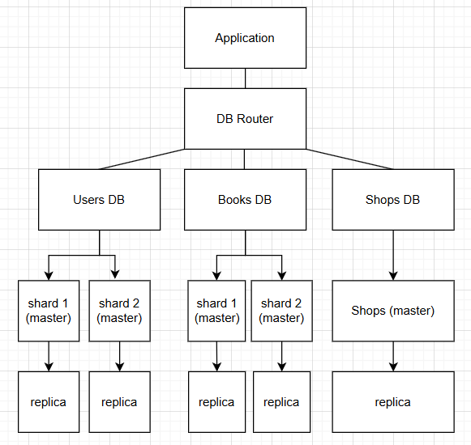

# Домашнее задание к занятию "Репликация и масштабирование. Часть 1" Nikiforov Viktor

# Database Scaling

## Задание 1. Преимущества масштабирования

### 1. Активный master и пассивный slave

**Преимущества:**

- Отказоустойчивость - при сбое master можно переключиться на slave.
- Резервная копия данных - slave содержит актуальную копию базы.
- Быстрое восстановление системы - не требуется восстановление из бэкапа.
- Простая архитектура - легко настроить и поддерживать.

Используется в основном для резервирования и высокой доступности системы.

---

### 2. Master и несколько slave

**Преимущества:**

- Масштабирование чтения - SELECT-запросы можно распределять между slave.
- Снижение нагрузки на master - master обрабатывает только операции записи.
- Повышение производительности - несколько серверов обслуживают чтение.
- Отказоустойчивость - при отказе одного slave можно использовать другой.
- Разделение задач - отдельные реплики можно использовать для аналитики и бэкапов.

Такая схема используется для масштабирования нагрузки и повышения производительности.

---

## Задание 2. План шардинга базы данных

База данных состоит из таблиц:

- users
- books
- shops

Для масштабирования используется комбинация вертикального и горизонтального шардинга.

---

## Вертикальный шардинг

Разделение базы данных по типам данных.

**Структура:**

| База данных | Таблицы |
|-------------|---------|
| Users DB    | users   |
| Books DB    | books   |
| Shops DB    | shops   |

**Преимущества:**

- уменьшение нагрузки на одну базу
- независимое масштабирование сервисов
- изоляция данных

---

## Горизонтальный шардинг

Разделение строк таблиц между несколькими серверами.

### Users DB

- shard 1 (master)
- shard 2 (master)

### Books DB

- shard 1 (master)
- shard 2 (master)

Каждый shard хранит часть данных и имеет собственную реплику.

---

## Репликация

Для повышения отказоустойчивости используется схема master -> replica.

| Тип сервера | Режим работы |
|-------------|--------------|
| master      | read/write   |
| replica     | read only    |

**Replica используется для:**

- обработки SELECT-запросов
- резервирования
- отказоустойчивости

---

## Общая архитектура системы

1. **Application** отправляет запросы к базе данных.
2. **DB Router** определяет нужную базу и шард.
3. Данные распределяются между:
   - Users DB
   - Books DB
   - Shops DB
4. Для Users и Books используется горизонтальный шардинг.
5. Каждый **master** имеет **replica** для чтения и отказоустойчивости.

---

## Блок-схема архитектуры

---
