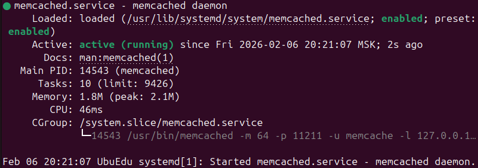
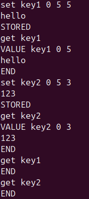
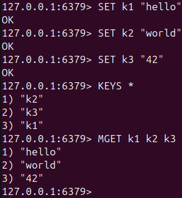
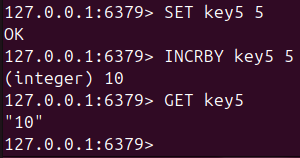

# Домашнее задание к занятию "Кеширование Redis/memcached" - Nikiforov Viktor

### Задание 1

## Кеширование

### Приведите примеры проблем, которые может решить кеширование

Примеры проблем, которые решает кеширование:
 - Снижение нагрузки на БД/внешние сервисы. Частые одинаковые запросы (профиль пользователя, каталог товаров) можно отдавать из кеша, а не дергать базу каждый раз.
 - Ускорение ответа приложения (latency). Доступ к памяти (Redis/Memcached) обычно быстрее, чем SQL/HTTP к внешнему API.
 - Сглаживание пиков нагрузки. При наплыве пользователей кеш помогает выдержать нагрузку, потому что данные берутся из памяти, а не пересчитываются.
 - Снижение стоимости запросов к платным API. Если внешний API тарифицируется по количеству вызовов, кеширование ответов экономит деньги.
 - Устранение дорогих вычислений. Результаты сложных вычислений (агрегации, рекомендации, рендеринг шаблонов) можно временно хранить.
 - Повышение стабильности при деградации зависимостей. Если внешний сервис подлагивает, можно отдавать последние закешированные данные.
 - Снижение нагрузки на дисковую подсистему. Кеш в памяти уменьшает количество чтений с диска.
 - Ускорение SSR/страниц и повторного рендера. Кеширование HTML/фрагментов

---

### Задание 2

## Memcached

### Установите и запустите memcached.

---

### Задание 3

## Удаление по TTL в Memcached

### Запишите в memcached несколько ключей с любыми именами и значениями, для которых выставлен TTL 5.

---

### Задание 4

## Запись данных в Redis

### Запишите в Redis несколько ключей с любыми именами и значениями.

---

### Задание 5

## Работа с числами

### Запишите в Redis ключ key5 со значением типа "int" равным числу 5. Увеличьте его на 5, чтобы в итоге в значении лежало число 10.

---
