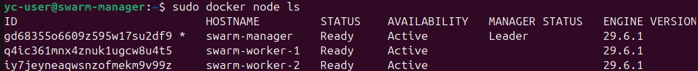

# Домашнее задание к занятию «Docker Swarm»

# Задача 1. Создание Docker Swarm-кластера в Яндекс Облаке

## Цель

Создать Docker Swarm-кластер в Яндекс Облаке, состоящий из одной manager-ноды и двух worker-нод.

---

## Создание виртуальных машин

Для создания виртуальных машин использовался **Yandex Cloud CLI**.

Создание manager-ноды:

```bash
yc compute instance create \
  --name swarm-manager \
  --hostname swarm-manager \
  --zone ru-central1-a \
  --cores 2 \
  --memory 2 \
  --create-boot-disk image-family=ubuntu-2404-lts,image-folder-id=standard-images,size=20GB \
  --network-interface subnet-id=e9bs31csr4jeeguflb5f,nat-ip-version=ipv4 \
  --metadata serial-port-enable=1 \
  --ssh-key ~/.ssh/id_ed25519.pub
```

Создание первой worker-ноды:

```bash
yc compute instance create \
  --name swarm-worker-1 \
  --hostname swarm-worker-1 \
  --zone ru-central1-a \
  --cores 2 \
  --memory 2 \
  --create-boot-disk image-family=ubuntu-2404-lts,image-folder-id=standard-images,size=20GB \
  --network-interface subnet-id=e9bs31csr4jeeguflb5f,nat-ip-version=ipv4 \
  --metadata serial-port-enable=1 \
  --ssh-key ~/.ssh/id_ed25519.pub
```

Создание второй worker-ноды:

```bash
yc compute instance create \
  --name swarm-worker-2 \
  --hostname swarm-worker-2 \
  --zone ru-central1-a \
  --cores 2 \
  --memory 2 \
  --create-boot-disk image-family=ubuntu-2404-lts,image-folder-id=standard-images,size=20GB \
  --network-interface subnet-id=e9bs31csr4jeeguflb5f,nat-ip-version=ipv4 \
  --metadata serial-port-enable=1 \
  --ssh-key ~/.ssh/id_ed25519.pub
```

Проверка созданных виртуальных машин:

```bash
yc compute instance list
```

---

## Установка Docker

На каждой виртуальной машине выполнена установка Docker:

```bash
curl -fsSL https://get.docker.com | sudo sh
sudo usermod -aG docker $USER
```

Проверка версии Docker:

```bash
docker --version
```

---

## Инициализация Docker Swarm

На manager-ноде выполнена команда:

```bash
docker swarm init --advertise-addr 10.128.0.23
```

После выполнения была получена команда подключения worker-нод.

---

## Подключение worker-нод

На обеих worker-нодах выполнена команда:

```bash
docker swarm join --token <TOKEN> 10.128.0.23:2377
```

После подключения обе машины успешно вошли в кластер.

---

## Проверка кластера

На manager-ноде выполнена команда:

```bash
docker node ls
```

Результат:

```text
ID                            HOSTNAME         STATUS    AVAILABILITY   MANAGER STATUS   ENGINE VERSION
gd68355o6609z595w17su2df9 *   swarm-manager    Ready     Active         Leader           29.6.1
q4ic361mnx4znuk1ugcw8u4t5      swarm-worker-1   Ready     Active                          29.6.1
iy7jeyneaqwsnzofmekm9v99z      swarm-worker-2   Ready     Active                          29.6.1
```

### Скриншот



---

## Итог

Создан Docker Swarm-кластер в Яндекс Облаке.

Состав кластера:

- **1 manager-нода**
  - `swarm-manager`

- **2 worker-ноды**
  - `swarm-worker-1`
  - `swarm-worker-2`

Все узлы имеют статус **Ready**, manager-нода имеет статус **Leader**, что подтверждает успешное создание и работоспособность Docker Swarm-кластера.
