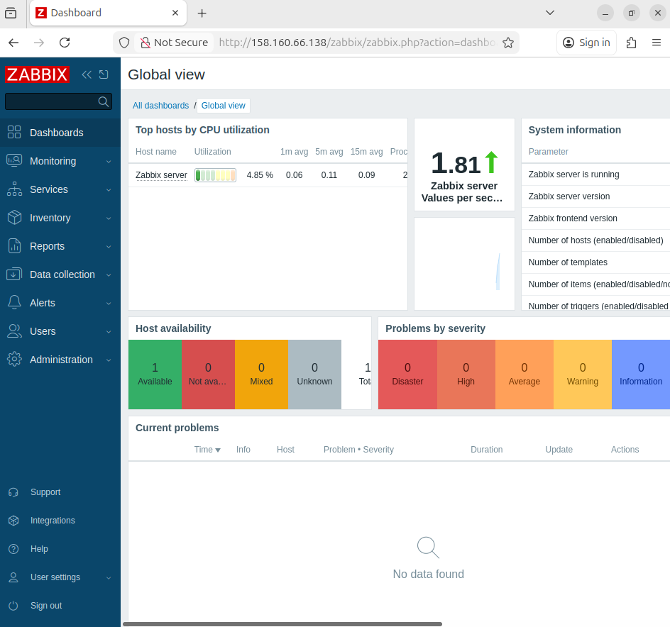
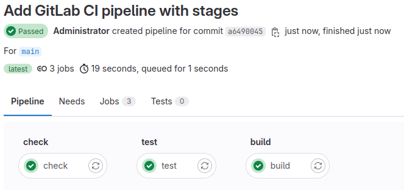
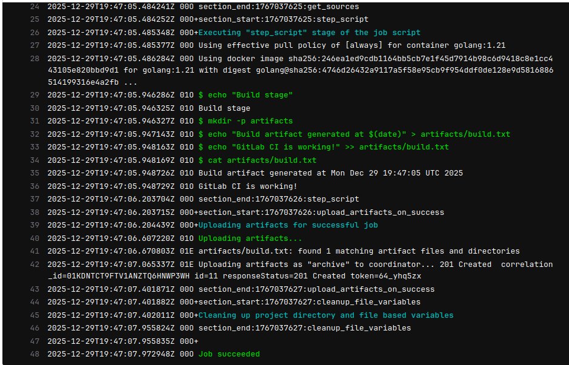

# Домашнее задание к занятию "Система мониторинга Zabbix" - Nikiforov Viktor

### Инструкция по выполнению домашнего задания

   1. Сделайте `fork` данного репозитория к себе в Github и переименуйте его по названию или номеру занятия, например, https://github.com/имя-вашего-репозитория/git-hw или  https://github.com/имя-вашего-репозитория/7-1-ansible-hw).
   2. Выполните клонирование данного репозитория к себе на ПК с помощью команды `git clone`.
   3. Выполните домашнее задание и заполните у себя локально этот файл README.md:
      - впишите вверху название занятия и вашу фамилию и имя
      - в каждом задании добавьте решение в требуемом виде (текст/код/скриншоты/ссылка)
      - для корректного добавления скриншотов воспользуйтесь [инструкцией "Как вставить скриншот в шаблон с решением](https://github.com/netology-code/sys-pattern-homework/blob/main/screen-instruction.md)
      - при оформлении используйте возможности языка разметки md (коротко об этом можно посмотреть в [инструкции  по MarkDown](https://github.com/netology-code/sys-pattern-homework/blob/main/md-instruction.md))
   4. После завершения работы над домашним заданием сделайте коммит (`git commit -m "comment"`) и отправьте его на Github (`git push origin`);
   5. Для проверки домашнего задания преподавателем в личном кабинете прикрепите и отправьте ссылку на решение в виде md-файла в вашем Github.
   6. Любые вопросы по выполнению заданий спрашивайте в чате учебной группы и/или в разделе “Вопросы по заданию” в личном кабинете.
   
Желаем успехов в выполнении домашнего задания!

### Задание 1....

## Zabbix Server with PostgreSQL and Apache

### Web-interface

### Commands

sudo apt update && sudo apt -y upgrade
sudo apt -y install postgresql
sudo systemctl enable --now postgresql

sudo -u postgres psql <<'SQL'
CREATE USER zabbix WITH PASSWORD '123456789';
CREATE DATABASE zabbix OWNER zabbix;
GRANT ALL PRIVILEGES ON DATABASE zabbix TO zabbix;
SQL

wget https://repo.zabbix.com/zabbix/7.0/ubuntu/pool/main/z/zabbix-release/zabbix-release_latest+ubuntu22.04_all.deb
sudo dpkg -i zabbix-release_latest+ubuntu22.04_all.deb
sudo apt update

sudo apt -y install zabbix-server-pgsql zabbix-frontend-php zabbix-apache-conf zabbix-sql-scripts zabbix-agent php-pgsql

zcat /usr/share/zabbix-sql-scripts/postgresql/server.sql.gz | sudo -u zabbix psql zabbix

sudo sed -i 's/^# DBPassword=.*/DBPassword=zabbix_password/' /etc/zabbix/zabbix_server.conf

sudo systemctl enable --now zabbix-server zabbix-agent apache2
sudo systemctl restart zabbix-server apache2

---

### Задание 2

## GitHub to GitLab

### Pipeline Passed

### Console Output

### CI Config

 
---
