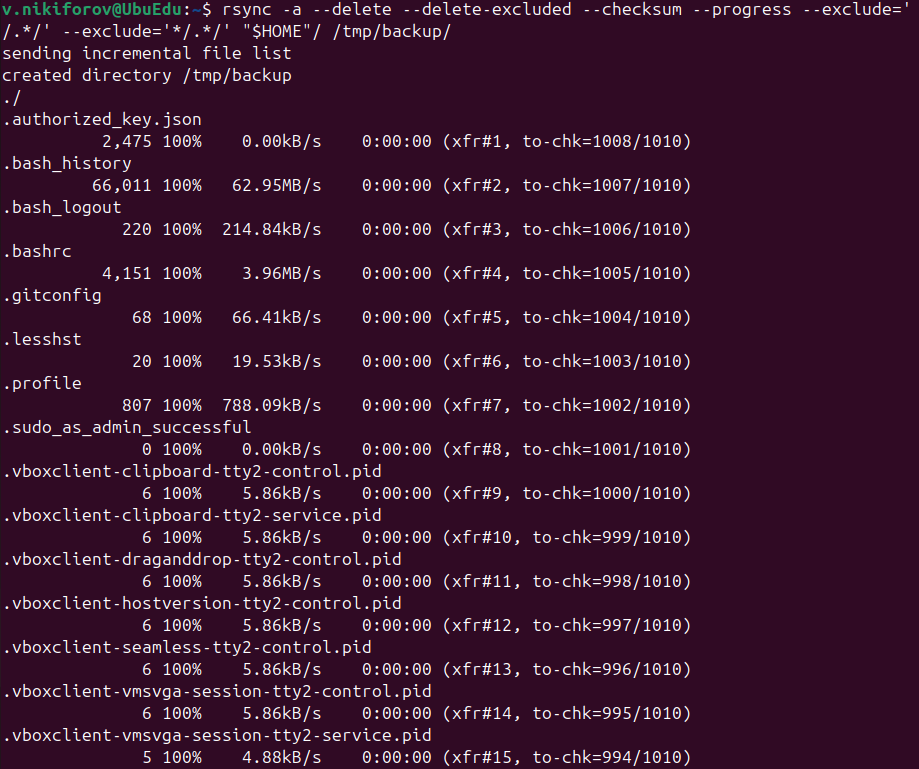
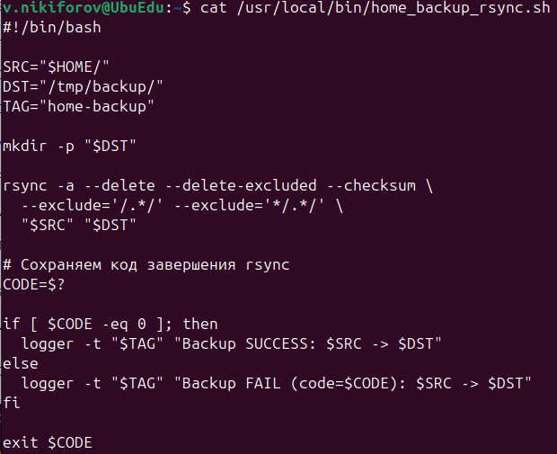
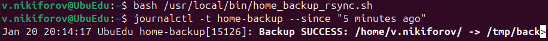

# Домашнее задание к занятию "Резервное копирование" - Nikiforov Viktor

### Задание 1

## Rsync Backup Without Hidden Directories

### Command Result

---

### Задание 2

## Rsync + Cron

### Bash Script

[home_backup_rsync.sh](home_backup_rsync.sh)

### Bash Script Result

### Crontab Rule  
[crontab.txt](crontab.txt)

---
